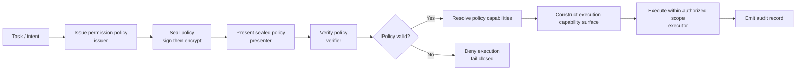
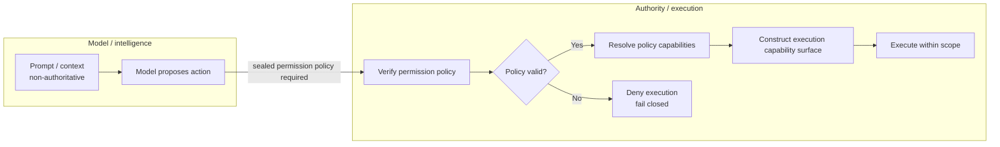
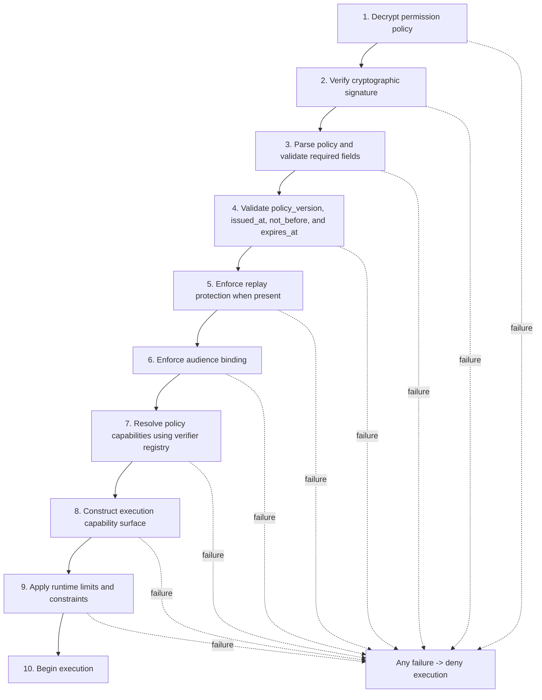
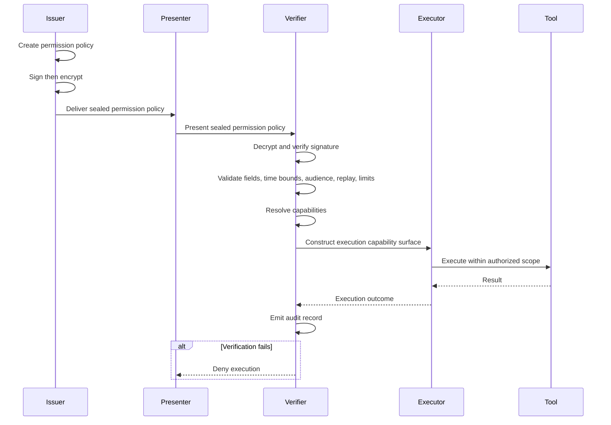

# Agent Permission Protocol (APP)

The Agent Permission Protocol (APP) is a protocol that requires explicit, cryptographically verifiable permission policies to gate agent execution at runtime.

As AI systems increasingly act through autonomous agents—invoking tools, modifying systems, and triggering irreversible outcomes—existing governance, policy, and access-control models have proven insufficient. In most architectures today, authority is inferred from access rather than explicitly validated at the moment an action executes.

APP exists to address this structural gap.

---

## At a glance

The Agent Permission Protocol (APP) answers one question: **Who authorized this action — and under what constraints — at the moment it executed?**

APP defines a permission object that must be validated at execution time, so authority is explicit, bounded, and verifiable.

---

## TL;DR

- APP is a public protocol for execution-time authority in agentic systems.
- It requires an explicit permission policy to be validated immediately before an action executes.
- Permissions are scoped, time-bounded, and revocable.
- Enforcement is independent of model reasoning or tool exposure.
- Stewardship and versioning are maintained by Crittora.

---

## Key facts

- APP is a minimal public specification for execution-time authority in agentic systems.
- Authority is represented as a cryptographically verifiable permission policy.
- Permissions are scoped, time-bounded, and revocable.
- Enforcement is independent of model reasoning.
- Stewardship and versioning are maintained by Crittora.

---

## Problem statement

Agentic systems introduce a failure mode that is not caused by model behavior, but by authorization design.

In common implementations:

- Authority is granted implicitly through credentials, roles, or tool exposure
- Permissions are treated as static configuration rather than runtime-validated objects
- Execution proceeds even when scope, duration, or consequence is ambiguous
- Exceptions accumulate without enforced revocation

As a result, systems may appear compliant while authority silently expands over time.

This failure mode is difficult to detect, difficult to audit, and difficult to reverse.

Any agent system that permits external action or tool invocation without presenting a verifiable permission policy at execution time is operating with ambient authority.

---

## Core principle

**Authority must be explicit, bounded, and verified at execution time.**

Capability alone is not authorization.  
Access alone is not intent.  
Policy alone does not enforce invariants.

The Agent Permission Protocol formalizes authority as a first-class object that must be validated immediately before an agent action is permitted to execute.  
Authority is enforced using cryptographically verifiable permission policies, not model compliance or implicit tool access.

---

## What APP defines

The Agent Permission Protocol specifies:

- Explicit authority grants for agent actions
- Scope constraints that limit what may be attempted
- Time bounds that restrict how long authority remains valid
- Predicate conditions that must be satisfied at execution
- Revocation semantics that fail closed
- Audit-safe validation independent of model reasoning

APP is concerned with whether an action may be attempted at all, not with how the action is carried out.

---

## Non-goals

APP does not attempt to:

- Define model alignment or safety techniques
- Replace identity or access management systems
- Provide agent orchestration frameworks
- Evaluate intent, reasoning quality, or output correctness
- Encode business logic or workflow design

The protocol is intentionally minimal. Its purpose is to define an invariant enforcement layer for agent authority.

---

## Why a protocol

Frameworks describe behavior.  
Policies document intent.  
Protocols define invariants.

APP enforces a separation between intelligence (what an agent proposes) and authority (what an agent is permitted to execute), enforced outside the model.

Agentic systems operate at machine speed, across systems, and without continuous human oversight. In such environments, authority must be governed by rules that are deterministic, enforceable, composable, and independent of model behavior.

APP exists to provide that invariant layer.

---

## Protocol diagrams

The diagrams below summarize the current `v0.2.0` public draft and align with the canonical whitepaper.

### Execution flow

Figure 1. No agent action or tool invocation is permitted unless a sealed permission policy is presented and verified before execution.

### Separation of intelligence and authority

Figure 2. The model may propose actions, but authority is enforced outside the model through policy verification and capability-derived execution control.

### Verifier pipeline

Figure 3. Validation is deterministic and fail-closed. Capability resolution and execution surface construction occur before execution begins.

### Sequence diagram

Figure 4. Issuer, presenter, verifier, executor, and tool interactions show sealing, presentation, verification, execution gating, and audit emission.

---

## Status

- Current version: **v0.2.0**
- Status: **Draft / Public Review**

`v0.2.0` is the first implementable draft. It formalizes the permission policy fields, deterministic capability resolution, ephemeral execution surfaces, bounded delegation, and release semantics needed for interoperable enforcement.

---

## Stewardship

The Agent Permission Protocol is stewarded by **Crittora**.

Stewardship implies maintenance, versioning, and editorial responsibility. It does not imply exclusive ownership, implementation rights, or control over downstream use.

The protocol is intended to be examined, challenged, and implemented independently.

---

## Canonical specification

The authoritative specification of the Agent Permission Protocol is published in the accompanying whitepaper:

**https://www.crittora.com/app/whitepaper**

This repository mirrors the released public version and changelog. The full mirrored whitepaper is also available on this site at [Whitepaper](whitepaper.md). In the event of wording divergence, the whitepaper at `crittora.com` is authoritative.

---

## Intended audience

This specification is written for:

- System architects designing agentic platforms
- Security engineers responsible for execution control
- Platform owners accountable for downstream outcomes
- Researchers evaluating agent governance primitives

It is not written for marketing, evangelism, or trend commentary.

---

## License

This repository is licensed under the Apache License, Version 2.0.

---

## Closing note

As agents gain the ability to act, the critical question is no longer what they can do.

It is:

**Who authorized this action — and under what constraints — at the moment it executed?**

The Agent Permission Protocol exists to make that question answerable by design.

---

_Stewarded by [Crittora](https://www.crittora.com/)._
